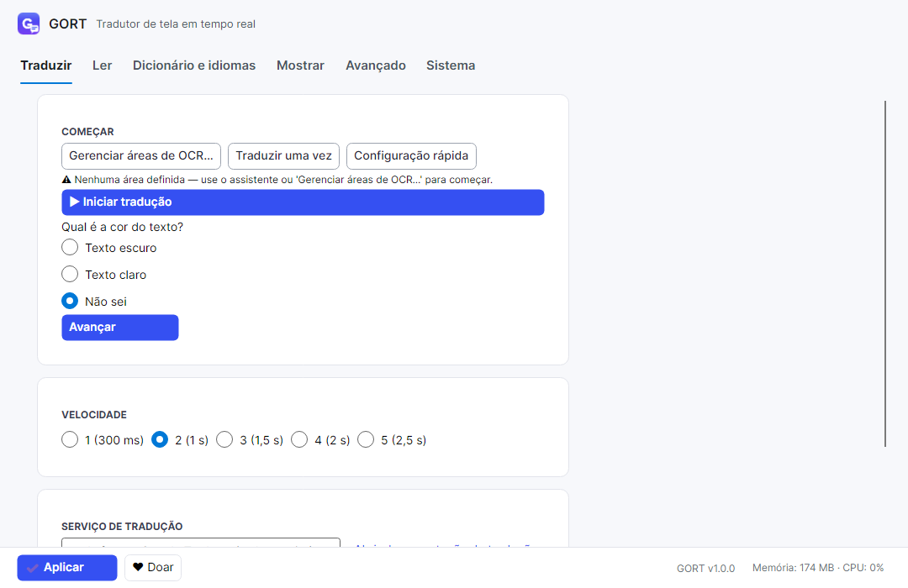
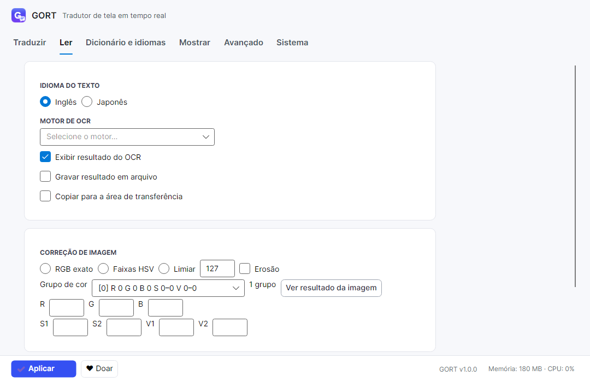
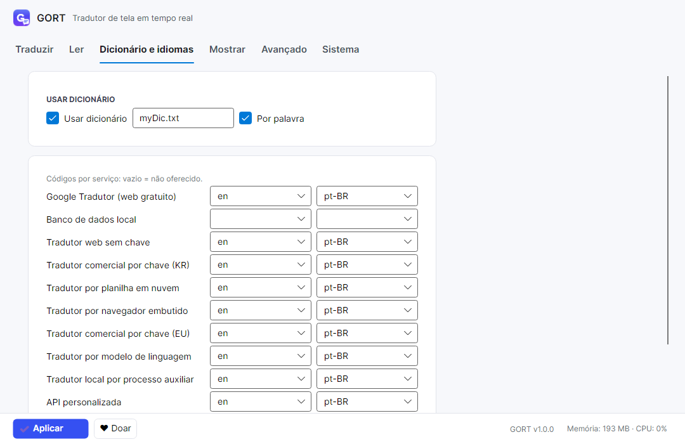
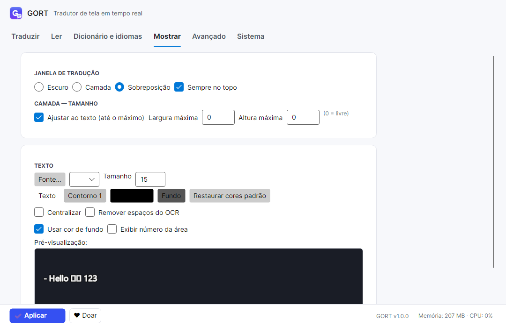
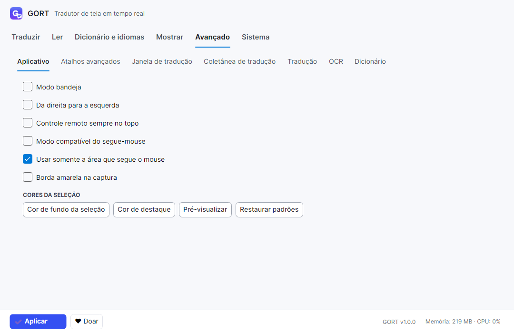
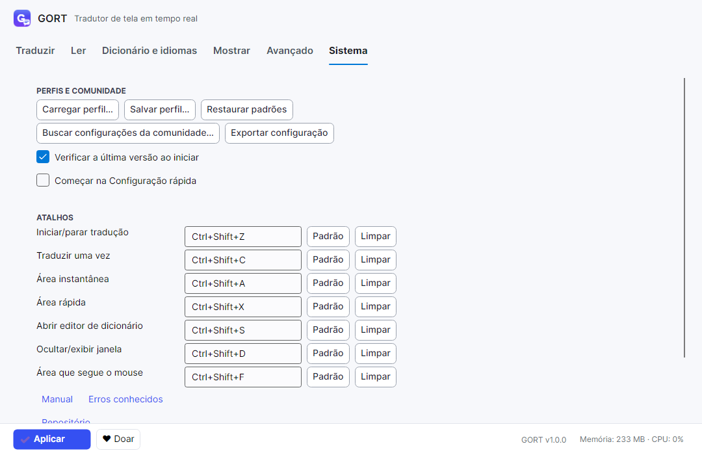
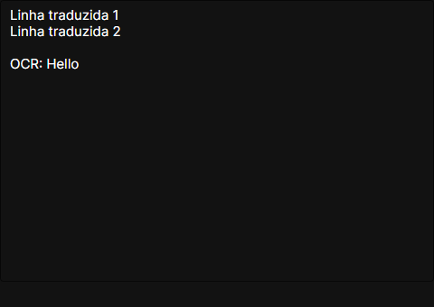
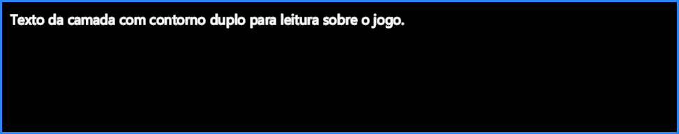
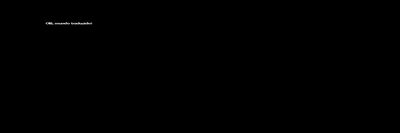
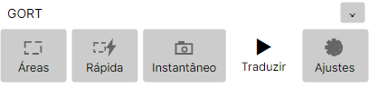

# GORT - Game Ocr RealTime

> Tradutor de tela em tempo real: japonês e inglês direto para PT-BR,
> sobre a imagem original. Sem sair do jogo, do mangá, do navegador
> ou do aplicativo.

O **GORT** captura áreas da tela com OCR, traduz o texto reconhecido e exibe
o resultado em português brasileiro na janela de tradução.

Fluxo básico: **Área de OCR → Motor de OCR → Serviço de tradução → Janela de tradução**.

## Recursos principais

- **Laço de tradução** (contínuo) e **Modo pontual** (traduzir uma vez, instantâneo).
- **Áreas de OCR**: várias áreas, áreas de exclusão, área rápida temporária e área que segue o mouse.
- **Motores de OCR**: moderno embarcado, sistema operacional, local clássico, ambiente interpretado e nuvem (somente modo pontual).
- **Serviços de tradução**: Google Tradutor (web gratuito), banco de dados local, web sem chave, comerciais por chave (KR/EU), planilha em nuvem, navegador embutido, modelo de linguagem, processo auxiliar local e API personalizada.
- **Dicionário de correção**, coletânea de tradução e memória de resultados.
- **Leitura em voz alta** do resultado.
- **Controle remoto**: barrinha com Áreas, Rápida, Instantâneo, Traduzir/Parar e Ajustes.
- **Interface em PT-BR**, com aplicação e salvamento pelo botão **Aplicar**.

## Modos de janela

| Modo | Uso |
|---|---|
| **Sobreposição** | Tradução desenhada sobre o texto original, no mesmo lugar. |
| **Camada** | Janela transparente posicionável, com contorno duplo de leitura. |
| **Escuro** | Janela com fundo escuro e texto rolável, ideal para textos longos. |

Opções comuns: sempre no topo, tamanho automático de fonte e contorno.

## Telas

Janela principal (abas Traduzir, Ler e Dicionário e idiomas):





Abas Mostrar, Avançado e Sistema:





Os três modos de tradução:





## Sobre o controle remoto



O controle remoto é a barrinha que fica sempre à mão enquanto você usa
outro programa. Cinco botões, cada um com ícone e nome:

| Botão | O que faz |
|---|---|
| **Áreas** | Abre o gerenciamento de áreas de OCR (desenhar, mover, excluir). |
| **Rápida** | Cria uma área temporária que não é salva (`Ctrl+Shift+X`). |
| **Instantâneo** | Traduz um trecho agora, uma única vez (`Ctrl+Shift+A`). |
| **Traduzir** | Inicia o laço; vira **Parar** (verde) enquanto traduz (`Ctrl+Shift+Z`). |
| **Ajustes** | Abre a janela principal de configurações. |

Detalhes úteis: a barrinha pode ser arrastada por qualquer ponto e
redimensionada pelo canto (mantém a proporção); o `×` do título só a
esconde — o programa continua rodando; passar o mouse mostra o que cada
botão faz mais o atalho.

## Como usar

1. Clique em **Áreas** e arraste na tela o retângulo onde o texto aparece.
2. Na aba **Traduzir**, escolha o serviço de tradução. Na aba **Ler**, escolha o motor de OCR.
3. Na aba **Mostrar**, escolha a janela: Sobreposição, Camada ou Escuro.
4. Clique em **Traduzir** (ou `Ctrl+Shift+Z`) para iniciar o laço.
5. Para um trecho isolado: **Instantâneo** (`Ctrl+Shift+A`).
6. Para algo temporário sob o cursor: **Rápida** (`Ctrl+Shift+X`) ou a área que segue o mouse (`Ctrl+Shift+F`).
7. Mudou alguma opção? Clique em **Aplicar**.

## Atalhos

| Atalho | Ação |
|---|---|
| `Ctrl+Shift+Z` | Iniciar / parar tradução |
| `Ctrl+Shift+C` | Traduzir uma vez |
| `Ctrl+Shift+A` | Área instantânea |
| `Ctrl+Shift+X` | Área rápida |
| `Ctrl+Shift+S` | Abrir editor de dicionário |
| `Ctrl+Shift+D` | Ocultar / exibir janela |
| `Ctrl+Shift+F` | Área que segue o mouse |

## Requisitos

- SDK do .NET 9 instalado.
- Windows x64, Linux x64, macOS x64 ou macOS ARM64 (Apple Silicon).

## Instalação por plataforma

Comandos a partir da pasta `src/`. A saída vai para `releases/`, que guarda
sempre só a última versão publicada.

```powershell
# Limpa a plataforma antes (evita resto de versão antiga)
Remove-Item ../releases/windows-x64 -Recurse -Force -ErrorAction SilentlyContinue

# Windows x64
dotnet publish Gort/Gort.csproj -c Release -r win-x64 --self-contained true -o ../releases/windows-x64

# Linux x64
dotnet publish Gort/Gort.csproj -c Release -r linux-x64 --self-contained true -o ../releases/linux-x64

# macOS x64
dotnet publish Gort/Gort.csproj -c Release -r osx-x64 --self-contained true -o ../releases/osx-x64

# macOS ARM64 (Apple Silicon)
dotnet publish Gort/Gort.csproj -c Release -r osx-arm64 --self-contained true -o ../releases/osx-arm64
```

Os modelos de OCR (`models/`) vêm do pacote NuGet e são copiados
automaticamente para a pasta de saída no publish.

## Como executar

1. Publique para a sua plataforma (seção acima).
2. Abra a pasta correspondente em `releases/` e execute o aplicativo GORT.

## Desenvolvimento

A partir de `src/` (Windows PowerShell 5.1):

```powershell
dotnet build Gort.sln -c Release --nologo -v q
dotnet test Gort.sln -c Release --no-build --nologo -v q --results-directory ../releases/test-results
```

- `bin/` + `obj/` de todos os projetos são centralizados em
  `releases/build/` (`src/Directory.Build.props`).
- PNGs dos testes visuais vão para `releases/visual-tests/`.
- Nada gerado fica dentro de `src/`.

## Estrutura do projeto

| Pasta | Conteúdo |
|---|---|
| `src/Gort/` | Aplicativo (.NET 9, Avalonia): `Lifecycle`, `Loop`, `Ocr`, `Translate`, `UI`, `Overlay`, `Regions`, `Locale` e outras |
| `src/Gort.Tests/` | 190 testes xUnit |
| `src/Gort.VisualTests/` | Testes de render headless (PNGs em `releases/visual-tests/`) |
| `releases/` | Toda saída gerada (não versionada, só o `PUBLICAR.md` é versionado) |

## Privacidade e dados locais

Tudo fica na sua máquina, em arquivos TOML:

- Windows: `%AppData%\GORT` · macOS: `~/Library/Application Support/GORT` · Linux: `~/.config/gort`
- `profile.toml`, `advanced.toml`, `app.toml`, `shortcuts.toml`, `profiles/`, `dicts/`, `collect/`
- **Atenção:** credenciais (`creds-{serviço}.toml`) ficam em **texto puro** na sua máquina — não compartilhe esses arquivos.
- A rede só é usada para traduzir (serviços web), verificar atualização e a lista da comunidade. OCR local, banco de dados e dicionário funcionam offline.

## Perguntas frequentes

**Tela cheia exclusiva funciona?** Não — use o jogo em modo janela ou janela sem borda.

**Funciona offline?** Em parte: OCR local, banco de dados e dicionário, sim. Tradutores web, atualização e comunidade precisam de rede (e avisam com elegância quando ela falta).

**Onde ficam meus dados?** Na pasta de dados acima. Apagar a pasta restaura os padrões.

## Links

| Destino | Endereço |
|---|---|
| Repositório | https://github.com/Lamartine-Brasil/GORT |
| Página do projeto | https://github.com/Lamartine-Brasil/GORT |
| Comunidade | https://github.com/Lamartine-Brasil/GORT |
| Manual | https://github.com/Lamartine-Brasil/GORT |
| Erros conhecidos | https://github.com/Lamartine-Brasil/GORT |
| Doações | https://github.com/Lamartine-Brasil/GORT |

## Autor

**Lamartine Barbosa** — autor e publicador único.

## Contribuidores

| Nome | Papel |
|---|---|
| [Lamartine Barbosa](https://github.com/Lamartine-Brasil) | Autor único — código, textos, visual e publicação |
