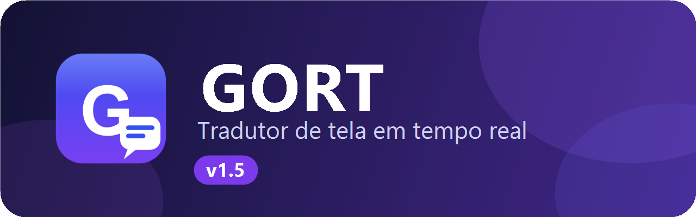
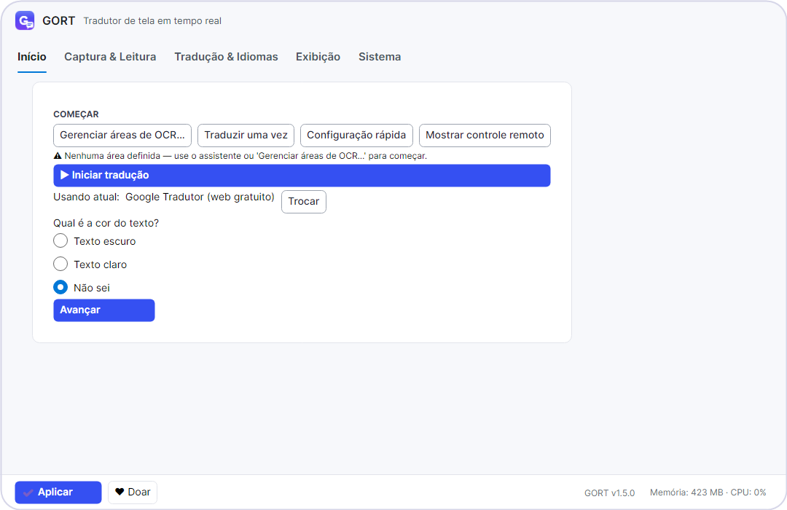
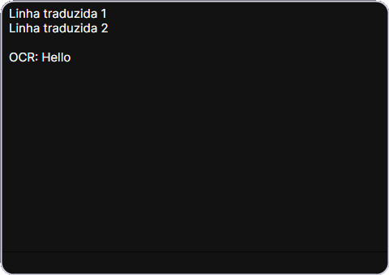
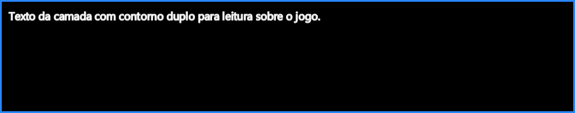
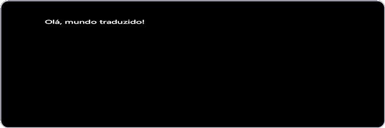
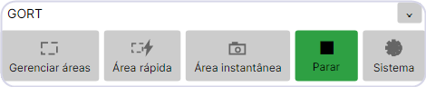
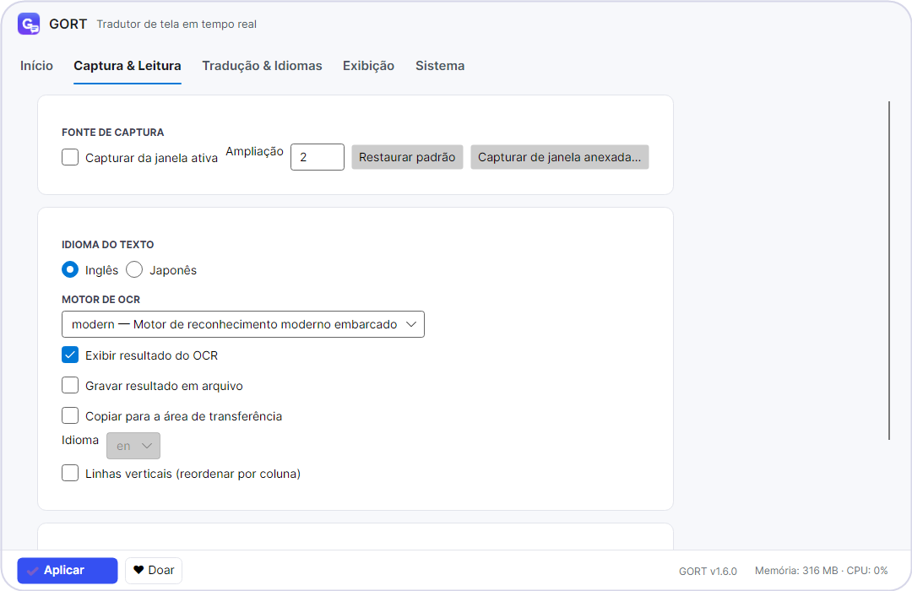
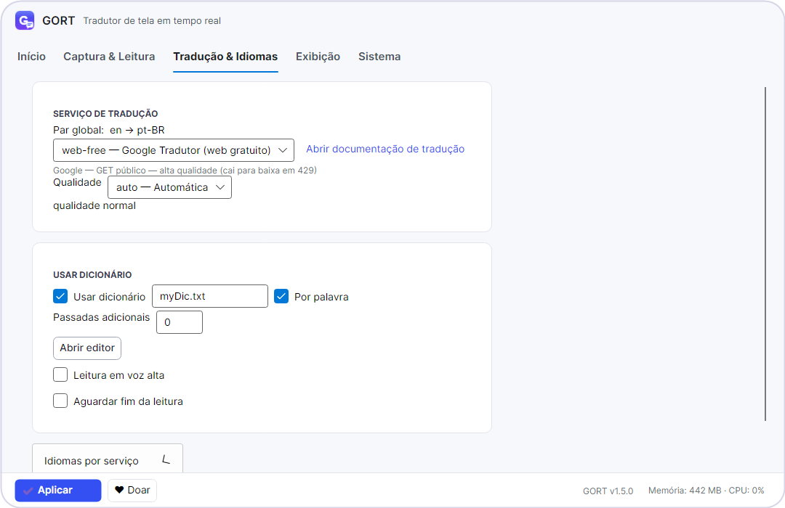
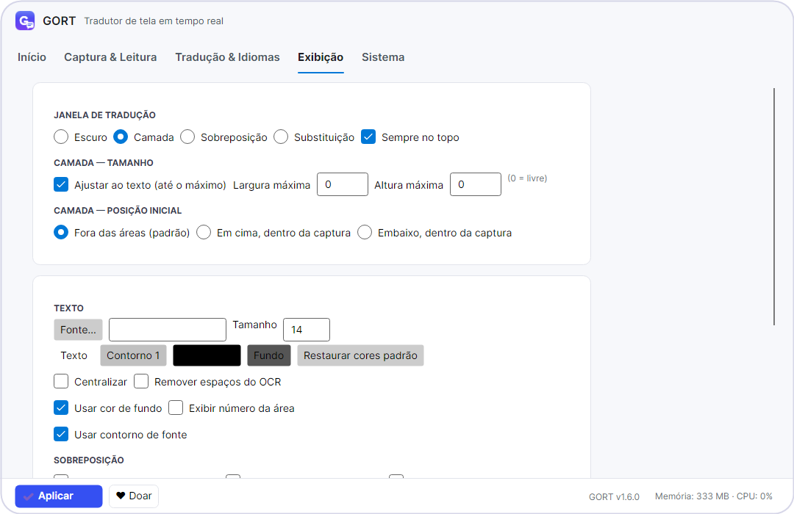
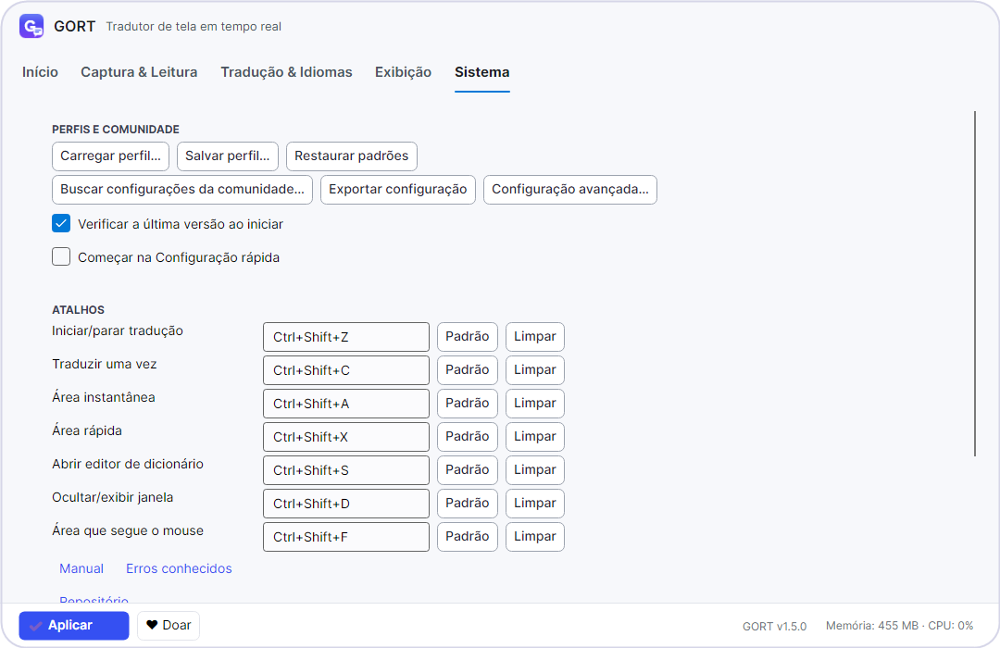

<p align="center">
  
</p>

<p align="center">
  
  
  
  
</p>

<p align="center">
  Jogando algo em japonês ou inglês e não entende nada?
  <br>
  O <b>GORT</b> lê o texto da tela e mostra a tradução em português
  <b>na hora</b>, sem você sair do jogo.
</p>

---

## Comece em 3 passos

**1. Marque a área** — clique em **Gerenciar áreas de OCR…** e arraste um
retângulo sobre a caixa de diálogo do jogo.

**2. Aperte Iniciar tradução** — clique em **Iniciar tradução** (ou
`Ctrl+Shift+Z`). Pronto, a tradução aparece sozinha a cada fala nova.

**3. Ajuste se precisar** — troque o serviço de tradução, a frequência ou
a aparência, e clique em **Aplicar**.



## Destaques da versão 1.6

| Recurso | O que faz |
|---|---|
| **4 jeitos de ver** | Escuro, Camada, Sobreposição e Substituição (tampa o original) |
| **Ajuste sozinho** | Sobreposição e Substituição escolhem o motor certo sozinhas |
| **10 serviços** | Do Google gratuito ao Gemini, planilha, banco local e API própria |
| **5 motores de leitura** | Moderno embarcado, sistema, clássico, interpretado e nuvem |
| **Dicionário seu** | Palavras suas com editor próprio, por palavra ou trecho |
| **Voz alta** | Lê a tradução em voz alta e pode esperar terminar |
| **Perfis** | Salva, carrega e busca configurações da comunidade |
| **Leve no jogo** | Só processa o que mudou; memória e CPU ao vivo no rodapé |

## De olho na tela: 4 jeitos de ver a tradução

|  |  |
|---|---|
| **Escuro** — janelinha escura com o texto, ideal para ler bastante coisa | **Camada** (padrão) — texto flutuante com contorno; fica sempre na frente e a posição inicial é configurável (fora, em cima ou embaixo da captura) |

|  |  |
|---|---|
| **Sobreposição** — texto desenhado em cima do original, no mesmo lugar | **Substituição** — igual, mas tampa o original com fundo opaco |

A Sobreposição e a Substituição ignoram cliques e ficam fora da captura,
então o programa nunca lê a própria tradução.

## O controle remoto

Aquela barrinha pequena que fica por cima de tudo, sempre à mão:

<p>
  
</p>

| Botão | Serve para |
|---|---|
| **Gerenciar áreas** | Gerenciar as regiões que serão lidas |
| **Área rápida** | Ler um pedaço novo rapidinho, sem salvar |
| **Área instantânea** | Traduzir um trecho agora, uma única vez |
| **Parar** | Liga/desliga (fica verde traduzindo) |
| **Sistema** | Abre as configurações |

Ela pode ser arrastada, redimensionada pelo canto e escondida pelo `×`
(o programa continua rodando).

## As telas do programa

Tudo em português, organizado em 5 abas. A aba Início aparece lá no
começo desta página; veja as outras quatro:

**Captura e Leitura** — fonte da captura, idioma do texto, motor de leitura
e o que fazer com o resultado:



**Tradução e Idiomas** — serviço de tradução, qualidade, dicionário
personalizado e leitura em voz alta:



**Exibição** — janela de tradução, tamanho da camada, texto, cores,
fundo, contorno e os ajustes finos da sobreposição:



**Sistema** — perfis, comunidade, verificação de versão e todos os
atalhos, cada um com botão de padrão e de limpar:



## Quem lê e quem traduz

**Motores de leitura (OCR):** moderno embarcado (padrão, já vem junto),
sistema operacional, clássico local, ambiente interpretado e nuvem
(somente modo pontual). Dá para ampliar a captura, ler da janela ativa
ou de janela anexada, e até seguir o mouse.

**Serviços de tradução:** Google Tradutor web gratuito (padrão),
banco de dados local, tradutor web sem chave, comercial por chave
(versões Coreia e Europa), planilha em nuvem, navegador embutido
(só Windows),
Gemini (modelo de linguagem), processo auxiliar local e API
personalizada. Cada serviço pode ter seu próprio par de idiomas; o
padrão é inglês → português, com japonês → inglês por serviço.

## Perguntas de quem está começando

**Precisa de internet?** Para traduzir pelo Google, sim. O dicionário e o
banco de dados funcionam sem internet.

**Pesa no jogo?** O rodapé mostra memória e CPU ao vivo. O programa evita
trabalho repetido (se a tela não mudou, ele nem processa de novo) e usa
no máximo 4 núcleos na leitura do texto.

**Tela cheia funciona?** Use o jogo em modo janela ou janela sem borda.
Tela cheia exclusiva não dá para capturar. Se a captura vier preta, o
programa avisa sozinho.

**Onde ficam meus dados?** Na sua máquina: perfis, dicionários e chaves,
em arquivos de texto simples. Nada vai para a nuvem além da tradução.

**E minha chave do Google (Gemini)?** Fica só no seu computador, num
arquivo separado que nunca entra no GitHub. Na aba Tradução e Idiomas tem
botão **Testar chave…** para conferir na hora.

## Atalhos que valem ouro

| Aperte | Acontece |
|---|---|
| `Ctrl+Shift+Z` | Liga / desliga a tradução |
| `Ctrl+Shift+C` | Traduz uma vez |
| `Ctrl+Shift+A` | Traduz um trecho agora (instantânea) |
| `Ctrl+Shift+X` | Área rápida temporária |
| `Ctrl+Shift+F` | Área que segue o mouse |
| `Ctrl+Shift+S` | Abre o editor de dicionário |
| `Ctrl+Shift+D` | Oculta / exibe a janela |

Todos podem ser trocados na aba Sistema, um por um.

## Baixar e instalar (Windows)

Na [página de lançamentos](https://github.com/Lamartine-Brasil/GORT/releases)
do GitHub, baixe o `Gort.exe` e execute — a versão é completa (com o .NET
junto) e não precisa instalar nada.

---

<details>
<summary><b>Para desenvolvedores (compilar do código)</b></summary>

Requisitos: `SDK` do `.NET` 9. Comandos a partir de `src/`:

```powershell
dotnet build Gort.sln -c Release --nologo -v q
dotnet test Gort.sln -c Release --no-build --nologo -v q --results-directory ../releases/test-results
```

Publicar (Windows x64, versão completa):

```powershell
Remove-Item ../releases/windows-x64 -Recurse -Force -ErrorAction SilentlyContinue
dotnet publish Gort/Gort.csproj -c Release -r win-x64 --self-contained true -o ../releases/windows-x64
```

Estrutura: `src/Gort/` (programa), `src/Gort.Tests/` (277 testes de
unidade), `src/Gort.VisualTests/` (12 testes visuais; os renders vão para
`releases/visual-tests/`), `releases/` (tudo gerado; só `PUBLICAR.md`
versionado), `docs/imagens/` (imagens desta página, versionadas).

</details>

## Links

| Destino | Endereço |
|---|---|
| Repositório | https://github.com/Lamartine-Brasil/GORT |
| Página do projeto | https://github.com/Lamartine-Brasil/GORT |
| Comunidade | https://github.com/Lamartine-Brasil/GORT |
| Manual | https://github.com/Lamartine-Brasil/GORT/blob/master/MANUAL.md |
| Erros conhecidos | https://github.com/Lamartine-Brasil/GORT |
| Doações | https://github.com/Lamartine-Brasil/GORT |

## Autor

**Lamartine Barbosa** — autor e publicador único.

| Nome | Papel |
|---|---|
| [Lamartine Barbosa](https://github.com/Lamartine-Brasil) | Autor único — código, textos, visual e publicação |
